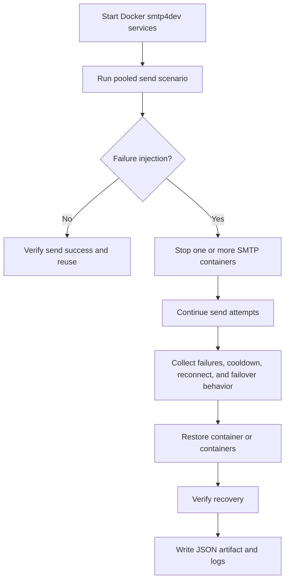

# Docker SMTP Test Scenarios

This page captures Docker-based SMTP test scenarios for pooled SMTP session
control, failover, cooldown, and reconnect validation.

It is intended as a reusable scenario catalog for systems that validate SMTP
pool behavior against disposable test infrastructure such as `smtp4dev`.

## Purpose

Use Docker-based SMTP scenarios when the goal is to verify:

- connection reuse
- pool saturation behavior
- reconnect suppression
- host cooldown
- multi-host failover
- recovery after outage
- ambiguity handling after transport disruption

## Test Topology

Typical local topology:

- `smtp4dev-1`
  - SMTP: `localhost:2525`
  - HTTP API: `http://localhost:5080`
- `smtp4dev-2`
  - SMTP: `localhost:2526`
  - HTTP API: `http://localhost:5081`

## Scenario Matrix

| Scenario | Primary goal | Expected observation |
|------|------|------|
| Basic send | Verify baseline SMTP send path | send succeeds and message is visible in API |
| Connection reuse | Verify pooled reuse | connection creation count stays below send count |
| Pool saturation | Verify bounded waiting | acquire timeout or explicit exhaustion occurs |
| Single-host outage | Verify reconnect suppression | reconnect attempts occur but are suppressed during cooldown |
| Sustained outage | Verify longer outage handling | repeated failures, cooldown activity, eventual recovery |
| Flapping outage | Verify repeated down/up handling | reconnect suppression grows and recovery repeats cleanly |
| Multi-host failover | Verify host priority fallback | send moves from primary to secondary |
| Multi-host weighted distribution | Verify host balancing | connection split matches configured weight |
| Multi-host partial outage | Verify one-host failure isolation | secondary continues while primary is unavailable |
| Ambiguous send interruption | Verify post-DATA safety | `UnknownAfterData` is surfaced and not blindly retried |

## Sequence Overview

## Detailed Scenarios

### 1. Basic Send

Objective:

- confirm that SMTP send works against the Docker target

Steps:

1. Start `smtp4dev-1`
2. Send one message
3. Query HTTP API for the subject

Expected:

- send succeeds
- message appears in the API

### 2. Connection Reuse

Objective:

- confirm that pooled sending reuses warm connections

Steps:

1. Start Docker SMTP target
2. Send multiple messages through the pool
3. Compare send count to connection creation count

Expected:

- send count is greater than connection creation count
- idle connections remain reusable after return

### 3. Pool Saturation

Objective:

- confirm that waiting is bounded

Steps:

1. Configure a small `MaxPoolSize`
2. Hold active leases or drive concurrent sends
3. Push concurrency beyond capacity

Expected:

- acquire wait time increases
- explicit exhaustion or timeout occurs

### 4. Single-Host Outage

Objective:

- confirm reconnect cooldown and suppression

Steps:

1. Start the SMTP container
2. Warm up the pool
3. Stop the container
4. Continue sending during the outage
5. Restore the container

Expected:

- failures occur during outage
- reconnect attempts are recorded
- suppressed reconnect count increases during cooldown
- sending recovers after restore

### 5. Sustained Outage

Objective:

- verify behavior during a longer outage window

Steps:

1. Start the SMTP container
2. Warm up
3. Stop the container for an extended period such as `20s` or `60s`
4. Continue periodic send attempts during the outage
5. Restore the container

Expected:

- outage attempts and failures accumulate
- connection-create failures are recorded
- suppressed reconnects increase
- recovery succeeds after cooldown expires

### 6. Flapping Outage

Objective:

- verify repeated stop/start behavior

Steps:

1. Start the SMTP container
2. Alternate `down` and `up` periods such as `5s down / 5s up`
3. Keep sending during the full sequence

Expected:

- reconnect suppression repeatedly activates
- recovery occurs after each `up` phase
- aggregate failure and reconnect counts remain explainable

### 7. Multi-Host Failover

Objective:

- verify primary to secondary fallback

Steps:

1. Start `smtp4dev-1` and `smtp4dev-2`
2. Configure host A as primary and host B as secondary
3. Send successfully through host A
4. Stop host A
5. Send again

Expected:

- first send uses host A
- second send retries and succeeds through host B

### 8. Multi-Host Weighted Distribution

Objective:

- verify same-priority weighted host selection

Steps:

1. Start both SMTP containers
2. Configure same priority with weights such as `3:1`
3. Warm up enough pooled connections
4. Inspect acquired endpoint distribution

Expected:

- connection split approximates configured weight

### 9. Multi-Host Partial Outage

Objective:

- verify that one failed host does not poison the whole system

Steps:

1. Start both SMTP containers
2. Warm up pooled sending
3. Stop only the primary host
4. Continue sends while secondary remains alive
5. Restore primary

Expected:

- secondary continues handling traffic
- primary-side failures remain isolated
- recovery succeeds after primary returns

### 10. Ambiguous Send Interruption

Objective:

- verify safe handling after the ambiguity boundary

Steps:

1. Start pooled send
2. Interrupt transport mid-send or during late SMTP exchange
3. Observe failure classification

Expected:

- failure is surfaced as ambiguous such as `UnknownAfterData`
- no blind automatic retry occurs

## Validation Output

Useful outputs to capture:

- success count
- failure count
- connection creation count
- reconnect attempt count
- suppressed reconnect count
- host used for success
- failure classification counts
- lease duration and send duration metrics
- artifact JSON path

## Notes

- Docker-based SMTP tests are good for connection lifecycle, cooldown, failover,
  and recovery validation.
- They do not replace final checks against the real relay environment.
- If more advanced network faults are required, a proxy-based fault injector is
  a better next step than plain container stop/start.
