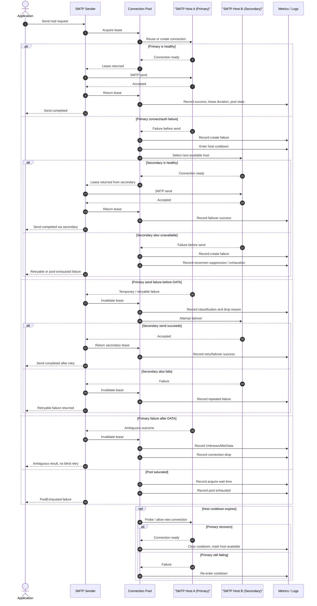
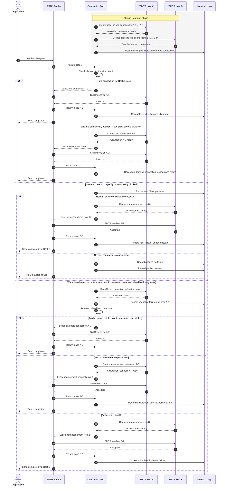

# SMTP Session Management Sequence

This page captures Mermaid sequences for SMTP session management with multiple
SMTP servers, host failover, cooldown, and error handling behavior.

It is intended as a reusable design reference for pooled SMTP sending flows.

## Sequence Diagram

## Per-Host Multi-Connection Flow

The following sequence focuses on the case where the pool may hold multiple
live connections for the same SMTP host.

It assumes:

- a minimum baseline may be created ahead of time during warmup
- additional capacity may still be created on demand
- host failover remains available when one host is blocked or unhealthy

